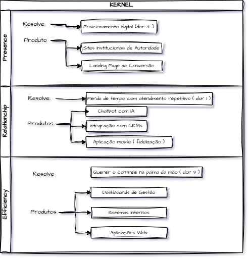

## 🧠 Kernel — O Núcleo da Transformação Digital

Kernel é um framework conceitual e operacional desenvolvido para ajudar empresas a estruturarem sua presença, automação e controle digital de forma integrada. Inspirado na arquitetura de sistemas, o projeto aplica lógica modular para criar soluções personalizadas e escaláveis.

## 🚀 Visão Geral

O Kernel atua como o núcleo estratégico de negócios digitais, transformando ideias em sistemas inteligentes e autossustentáveis.
Ele se baseia em uma estrutura de três camadas — Presence, Relationship e Efficiency — que refletem as etapas essenciais de maturidade digital de uma empresa.

🎯 Valor Entregue

O Método Kernel foi desenhado para o Delegador Premium Sobrecarregado — o empreendedor que quer escalar seu negócio sem perder tempo ou controle.

| Desejo           | Como o Kernel Resolve                    |
| :--------------- | :--------------------------------------- |
| 🕒 **Tempo**     | Automatizando tarefas repetitivas        |
| 🤝 **Confiança** | Tornando-se o parceiro técnico confiável |
| 📊 **Controle**  | Oferecendo dashboards e insights         |
| 🌴 **Liberdade** | Devolvendo tempo de vida e tranquilidade |

### 💡 Filosofia do Projeto
`“Negócios digitais não se constroem apenas com design ou código — mas com lógica, arquitetura e propósito.”`

**O Kernel é mais do que uma metodologia:**: é uma forma de pensar sistemas como organismos vivos, onde cada módulo serve à visão global do negócio.